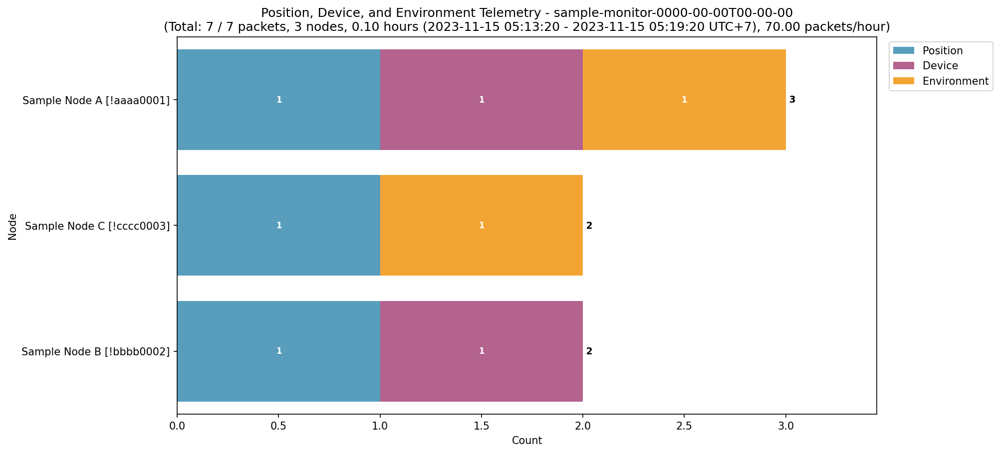

# Анализ дампов пакет‑монитора MeshMonitor

Этот репозиторий содержит утилиту для анализа дампов пакетов [MeshMonitor](https://meshmonitor.org) и построения наглядных гистограмм по частоте отправки сервисных пакетов геопозиции и телеметрии, которые могут излишне нагружать сеть.

Для нод из верхней части списка имеет смысл снизить частоту отправки пакетов в настройках Position, Telemetry -- Device Metrics и Environment.

## Пример гистограммы



## Структура

- `spamers.py` — основной скрипт анализа дампов и построения гистограмм.
- `samples/` — искусственный пример дампа и готовая картинка, чтобы видеть ожидаемый результат.
- `ignored_nodes.txt` — список нод, которые нужно исключать из статистики.
- `requirements.txt` — зависимости Python.

## Формат входных данных

Ожидаются файлы формата **JSONL** (`*.jsonl`) в текущем каталоге:

- один JSON‑объект на строку;
- поле `from_node_id` используется как идентификатор ноды (строка вида `!xxxxxxxx`);
- поля `payload_preview`, `from_node_longName` и др. берутся из дампов пакет‑монитора.

В каталоге `samples/` лежит файл `sample-monitor-0000-00-00T00-00-00.jsonl` с полностью вымышленными данными.

## Игнорируемые ноды (`ignored_nodes.txt`)

В файле `ignored_nodes.txt` указываются ноды, которые нужно полностью исключить из статистики. Это должен быть приёмник / «базовая» нода, на которой крутится захват пакетов и которая пишет в лог много локальных пакетов, не уходящих в сеть.

Правила:

- один ID ноды в строке, **в том же формате, что `from_node_id`** — с ведущим `!` (например, `!0b86cb7a`);
- строки, начинающиеся с `#`, считаются комментариями и игнорируются;
- если файл пуст, скрипт автоматически выберет доминирующую ноду по числу пакетов и проигнорует её.

## Запуск

### Первый запуск

Установка виртуального окружения и зависимостей:

```bash
python -m venv venv
```

**Linux/macOS:**

```bash
source venv/bin/activate
pip install -r requirements.txt
```

**Windows (PowerShell):**

```powershell
venv\Scripts\Activate.ps1
pip install -r requirements.txt
```

**Windows (cmd.exe):**

```cmd
venv\Scripts\activate.bat
pip install -r requirements.txt
```

### Построение гистограммы
Поместите нужные `*.jsonl` файлы в каталог и выполните:

```bash
python spamers.py
```

Будет выведена текстовая сводка по нодам и созданы PNG‑файлы с комбинированными гистограммами.

### Параметр пересоздания гистограмм

Скрипт поддерживает флаг `--recreate`:

- `python spamers.py` — создаёт только отсутствующие гистограммы;
- `python spamers.py -r` — пересоздаёт **одну** самую свежую гистограмму;
- `python spamers.py -r N` — пересоздаёт **N** самых свежих гистограмм;
- `python spamers.py -r all` — пересоздаёт гистограммы для **всех** JSONL‑файлов из каталога.


